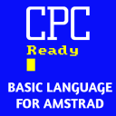

<p align="center">

</p>

# Amstrad Basic Laguage 

LOCOMOTIVE SOFTWARE AMSTRAD CPC BASIC syntax highlighting for Visual Studio Code.

This extension is a port of the one created by dfreniche [fdfreniche](https://github.com/dfreniche/amstradbasic-vscode.git)

Comments are added to lines "1 '"

## Basic

### Statements

```text
AFTER, AUTO, BORDER, BREAK, CALL, CAT, CHAIN MERGE, CHAIN, CLEAR, CLG, 
CLOSEIN, CLOSEOUT, CLS, CONT, DATA, DEF FN, DEFINT, DEFSTR, DEFREAL, DEG, 
DELETE, DI, DIM, DRAW, DRAWR, EDIT, EI, ELSE, END, ENT, ENV, ERASE, ERROR, 
EVERY, FOR, GOSUB, GOTO, IF, INK, INPUT, KEY DEF, KEY, LET, LINE INPUT, LIST, 
LOAD, LOCATE, MEMORY, MERGE, MODE, MOVE, MOVER, NEW, NEXT, ON, OUT, OPENIN, 
OPENOUT, ORIGIN, PAPER, PEN, PLOT, PLOTR, POKE, PRINT, SPC, TAB, USING, RAD, 
RANDOMIZE, READ, RELEASE, RENUM, RESTORE, RESUME, RETURN, RUN, SAVE, SOUND, 
STEP, SPEED, SYMBOL, SWAP, TAG, TAGOFF, TRON, TROFF, THEN, TO, STEP, STOP, 
UNT, WAIT, WEND, WHILE, WIDTH, WINDOW, WRITE, ZONE
```

### Functions

```text
ABS, ASC, ATN, BIN, CHR$, CINT, CREAL, COS, EOF, ERR, ERL, EXP, FIX, FRE, 
HIMEM, INKEY, INKEY, INP, INTRS, INT, JOY, LEFT, LEN, LOG10, LOG, LOWER, MIN, 
MAX, MID, PEEK, PI, POS, REMAIN, RIGHT, RND, ROUND, SIN, SQ, SQR, STR$, STRING$, 
SGN, TAN, TEST, TESTR, TIME, UPPER, VAL, XPOS, YPOS
```

### Operators

```text
AND, NOT, OR, XOR, MOD
```


## Comments

Add comment "1 '" to bas files, for programming vscode (not for amstrad cpc)


---

## ugBasic

Compilated Basic for Amstrad CPC [user manual](https://retroprogramming.iwashere.eu/ugbasic:user)

```text
 16BIT AAHS ABS ACCORDION ACOUSTIC ADD ADDRESS AGE AGOGO 
 ALL ALT ALTO AND APPLAUSE ARRAY ARROW AS ASC 
 ASM ASTERISK AT ATARI ATARIXL ATMOSPHERE AUTO BACK BACKGROUND 
 BAG BANJO BANK BANKED BAR BARITONE BASS BASSOON BEG 
 BEGIN BELL BELLS BELONG BETA BIN BINARY BIRD BIT 
 BITMAP BITMAPS BLACK BLIT BLOWN BLUE BOOM BORDER BOTTLE 
 BOWED BOX BRASS BREATH BRIGHT BRIGHTNESS BROWN BUFFER BUT 
 BYTE CALL CALLIOPE CAN CAPS CAPSLOCK CASE CDOWN CELESTA 
 CELLO CENTER CENTRE CHAR CHARANG CHIFF CHOIR CHR CHURCH 
 CIRCLE CLARINET CLASS CLAVI CLEAN CLEAR CLEFT CLINE CLIP 
 CLS CMOVE COCO CODE COLECO COLLISION COLON COLOR COLORMAP 
 COLORS COLOUR COLOURMAP COLOURS COLUMN COLUMNS COMMA COMMODORE COMPLETE 
 COMPRESS COMPRESSED CONST CONTRABASS CONTROL COPY COS COUNT CPC 
 CRIGHT CRSR CRYSTAL CSPRITE CUP CURSOR CYAN CYCLES CYMBAL 
 DARK DATA DEBUG DECLARE DEFAULT DEFINE DEGREE DELAY DELETE 
 DESTINATION DIM DISABLE DISTANCE DISTORTION DIV DLOAD DO DONE 
 DOUBLE DOWN DRAGON DRAW DRAWBAR DRUM DRUMS DTILE DTILES 
 DULCIMER DWORD ECHOES ECM ELECTRIC ELLIPSE ELSE ELSEIF EMBEDDED 
 EMPTY EMPTYTILE ENABLE END ENDIF ENDSELECT ENDSTORAGE ENGLISH ENSEMBLE 
 EQUAL EVERY EXACT EXEC EXIT EXPAND EXPLICIT EXPLOSION FALSE 
 FAST FI FIDDLE FIFTHS FILEX FILL FINGER FIRE FIRST 
 FLIP FLOAT FLUTE FONT FOR FRAME FRAMES FREE FRENCH 
 FRET FRETLESS FROM FUNCTION FX GAMELOOP GET GLOBAL GLOCKENSPIEL 
 GOBLINS GOLD GOSUB GOTO GR GRAND GRAPHIC GRAY GREEN 
 GREY GUITAR GUNSHOT HALO HALT HALTED HARMONICA HARMONICS HARP 
 HARPSICHORD HAS HEIGHT HELICOPTER HEX HIDDEN HIDE HIT HOME 
 HONKY HORIZONTAL HORN HSCROLL ID IF IGNORE IMAGE IMAGES 
 IN INDEX INK INKEY INPUT INSERT INSTR INSTRUMENT INT 
 INTEGER INVERSE IS JAZZ JDOWN JFIRE JLEFT JOY JOYCOUNT 
 JRIGHT JUP KALIMBA KEY KEYBOARD KEYSHIFT KEYSTATE KILL KOTO 
 LAVENDER LAYER LBOUND LEAD LEFT LEN LET LETTER LIGHT 
 LINE LOAD LOCATE LOCK LONG LOOP LOWER MAGENTA MAP 
 MARIMBA MASKED MAX MCM MELODIC MEMORIZE MEMORY METALLIC MID 
 MILLISECOND MILLISECONDS MIN MINUS MMOVE MOD MODE MONOCOLOR MONOCOLOUR 
 MOVE MSX MUL MULTICOLOR MULTICOLOUR MUSIC MUTED NAMED NEW 
 NEXT NOISE NONE NOP NORMAL NOT NOTE NYLON OBOE 
 OCARINA OF OFF OLIVE ON ONLY OOHS OPACITY OPTION 
 OP_DEC OP_INC OR ORANGE ORCHESTRA ORCHESTRAL ORGAN ORIGIN OUT 
 OVERDRIVEN OVERLAYED PAD PALETTE PAN PAPER PARALLEL PARAM PEACH 
 PEEK PEN PER PERCUSSIVE PERIOD PI PIANO PICCOLO PICK 
 PINK PIPE PIZZICATO PLAY PLOT PLUS POINT POKE POLYLINE 
 POLYSYNTH POP POSITION POSITIVE POUND POWERING PRECISION PRESERVE PRESSED 
 PRINT PROBABILITY PROC PROCEDURE PURPLE PUT RADIAN RAIN RANDOM 
 RANDOMIZE RASTER RATE RATIO RAW READ READONLY RECORDER RED 
 REED REGISTER RELATIVE RELEASE REMEMBER RENDER REPEAT REPLACE RESOLUTION 
 RESPAWN RETURN REVERSE RGB RIGHT RING RND ROCK ROLL 
 ROW ROWS RUN RUNSTOP SAWTOOTH SAX SCAN SCANCODE SCANSHIFT 
 SCI SCREEN SCROLL SEASHORE SECOND SECTION SELECT SEMICOLON SEMIGRAPHIC 
 SEPARATOR SEQUENCE SET SGN SHADES SHAKUHACHI SHAMISEN SHANAI SHARED 
 SHIFT SHIFTS SHOOT SHOW SIGNED SIN SINGLE SITAR SIZE 
 SLAP SLASH SLICE SOPRANO SOUND SOUNDTRACK SOURCE SPACE SPAWN 
 SPRITE SQR SQUARE STACK STANDARD STATE STEEL STEP STOP 
 STORAGE STR STRING STRINGS SWAP SWEEP SYNTH SYNTHBRASS SYNTHSTRINGS 
 SYS SYSTEM TAB TAIKO TAN TANGO TASK TELEPHONE TEMPORARY 
 TENOR TEXT TEXTADDRESS TEXTMAP THEN THREAD THRESHOLD TI TICK 
 TICKS TILE TILEMAP TILES TILESET TIME TIMER TIMPANI TINKLE 
 TO TOM TONK TRANSPARENCY TRANSPARENT TREMOLO TROMBONE TRUE TRUMPET 
 TUBA TUBULAR TURQUOISE TWEET TYPE UBOUND UNIQUE UNTIL UP 
 UPPER USE USING VAL VALUE VAR VARIABLES VARPTR VBL 
 VERTICAL VIBRAPHONE VIDEO VIOLA VIOLET VIOLIN VISIBLE VOICE VOLUME 
 VSCROLL WAIT WARM WEND WHILE WHISTLE WHITE WIDTH WITH 
 WOODBLOCK WORD WRITE WRITING XCURS XGR XGRAPHIC XOR XPEN 
 XTEXT XY XYLOPHONE YCURS YELLOW YGR YGRAPHIC YIELD YPEN 
 YTEXT YX ZX 
```